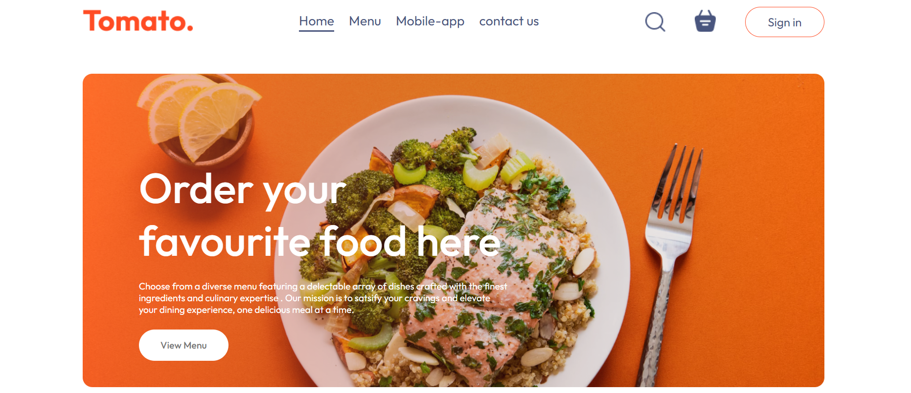
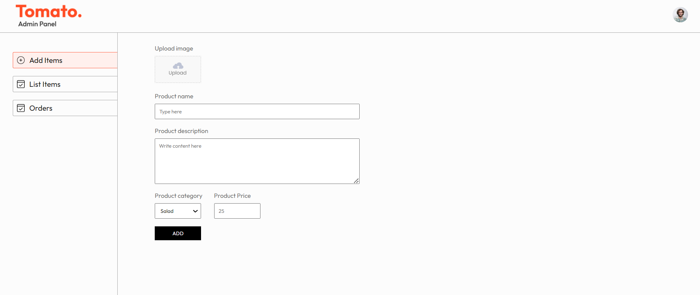
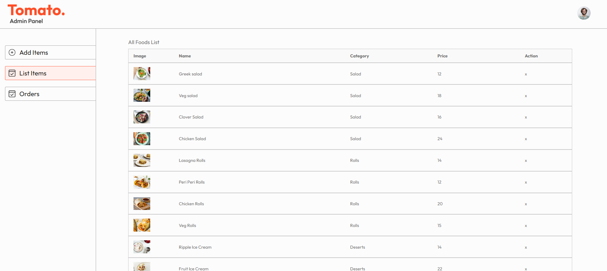
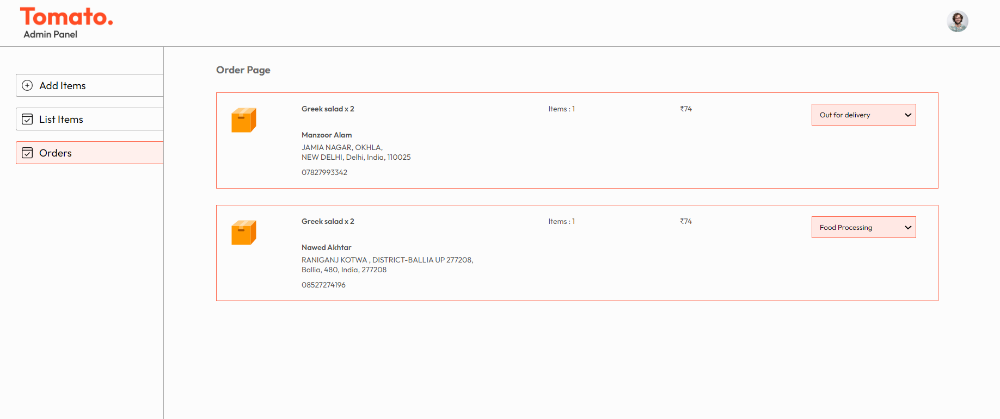

# MERN Food Delivery Web Application

A fully functional food delivery web application built using the MERN stack (MongoDB, Express, React, and Node.js) with payment integration through Stripe. The application includes an admin interface for managing orders and tracking the status of food delivery.


## Frontend Interface



## Features

- **User Authentication**: Users can register, log in, and log out securely.
- **Food Ordering**: Browse available food items and place an order.
- **Stripe Integration**: Secure payment processing via Stripe.
- **Admin Interface**: Admins can manage orders and update the status (e.g., Processing, Delivered).
- **Order Status Tracking**: Users can track the status of their orders in real time.
- **Responsive Design**: Optimized for both desktop and mobile devices.

## Tech Stack

### Frontend:
- **React.js**: JavaScript library for building user interfaces.
- **State Management**: Managed using **Context API** for global state handling.
- **React Router DOM**: Used for client-side routing, enabling navigation between pages.
- **Axios**: For making HTTP requests such as GET and POST to interact with the backend.
- **React Toastify**: Provides toast notifications for displaying messages to the user.
- **CSS Frameworks**: Custom CSS and any preferred frameworks for styling.

### Backend:
- **Node.js**: JavaScript runtime environment for server-side logic.
- **Express.js**: Web framework for building the RESTful API.
- **MongoDB**: NoSQL database used to store application data.
- **Mongoose**: Object Data Modeling (ODM) library for MongoDB and Node.js.
- **JWT (JSON Web Token)**: Used for secure user authentication.
- **Bcrypt**: For hashing and securing user passwords.
- **CORS**: Middleware for enabling Cross-Origin Resource Sharing between frontend and backend.
- **Dotenv**: Loads environment variables from a `.env` file into the app.
- **Body-parser**: Middleware for parsing incoming request bodies in a middleware before handlers.
- **Multer**: Middleware for handling file uploads.
- **Stripe**: Payment gateway used to handle secure payment processing.
- **Validator**: Library for data validation and sanitization.
- **Nodemon**: Tool for automatically restarting the server during development.

## Installation

1. Clone the repository:
   ```bash
   git clone https://github.com/iamnawed/food_del.git
   cd food-delivery-app

2. Install dependencies for both the backend and frontend:
   ```bash
    # Backend
    cd backend
    npm install
    
    # Frontend
    cd ../frontend
    npm install

  3.Set up environment variables: Create a .env file in the root directory of the backend with the following:
    ```bash
    
    MONGO_URI=your_mongodb_connection_string
    JWT_SECRET=your_jwt_secret
    STRIPE_SECRET_KEY=your_stripe_secret_key

 4.Start the application:

  Backend:   
  
     cd backend
     npm start
     
  Frontend:
  
      cd ../frontend
      npm start
      
5.Visit the app in your browser at http://localhost:3000.

## Admin Panel

The admin panel provides administrators with control over the food delivery system and includes the following features:

1. **Add New Food**: 
   - Admins can add new food items to the menu. This includes specifying details such as the name, price, description, and any other relevant information.

2. **View Listed Foods**: 
   - Admins can view all the currently listed food items. This allows them to see what is available for customers to order.

3. **Manage Orders**: 
   - Admins can view all customer orders and update their status. The status can be changed to "Processing" or "Delivered" to reflect the current state of the order.

### Technologies Used:
- **React.js**: For building the admin user interface.
- **Axios**: For making HTTP requests to the backend to add new food items and manage orders.
- **Express.js**: Used in the backend to handle API requests related to food items and order status.
- **MongoDB**: To store and retrieve data about food items and orders.
- **Mongoose**: For interacting with MongoDB and managing data related to food and orders.

### Admin Panel Screenshots






